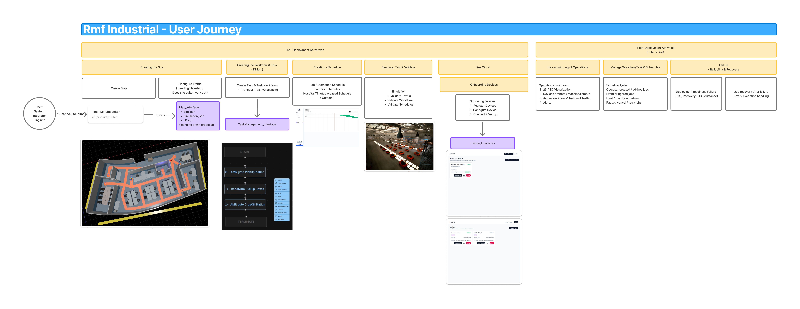
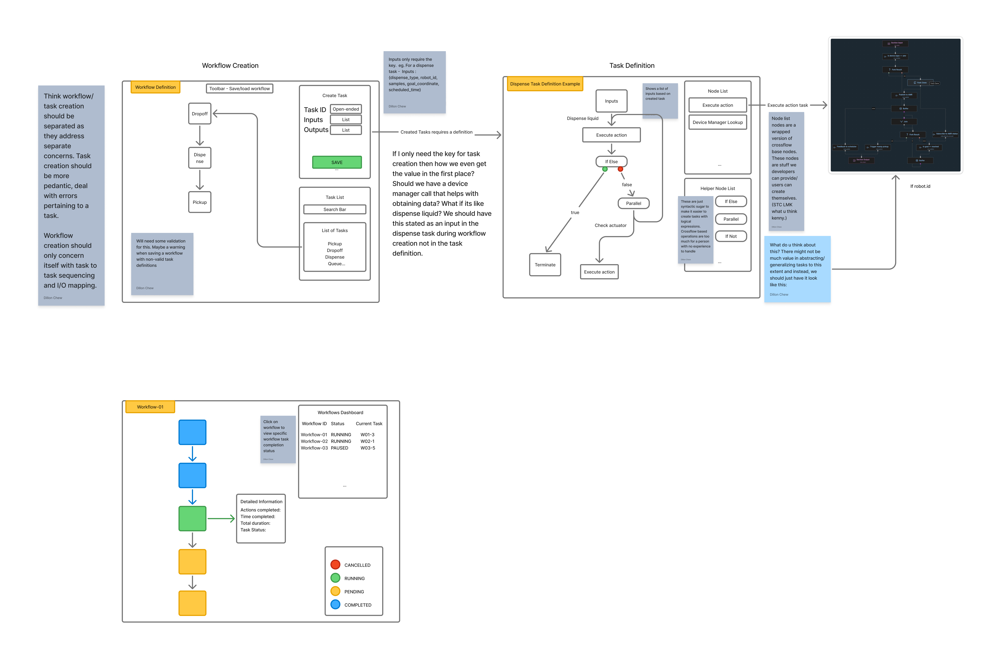
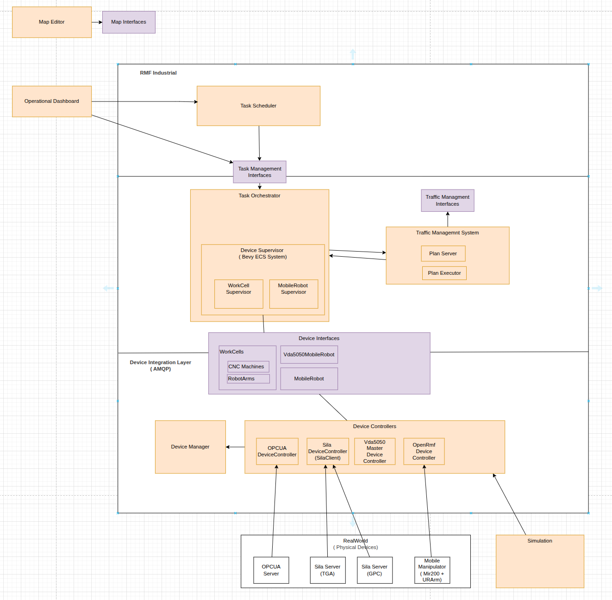

# RmfIndustrial V0.2.0 , Design Proposal 

## High Level - User Journey: Robot Deployment 

### Pre-Deployment Activities
1. Creating a Site
    - Creating a Map  
    - Configuring Traffic ( @ChianFern to review)

    RMF Industrial will adopt and customize the Open-RMF Site Editor , to export our [map_interfaces](../rmf2_interfaces/map_interfaces/.gitkepp)

    Open-RMF Site Editor: https://open-rmf.github.io/rmf_site/web/_

2. Creating Workflows/ Task 
    - Creating workflows/ Task UI Wireframes
    

3. Creating a Schedule 
    - This will be custom for Lab Automation/ Factory/ Hospital
    
4. Simulate, Test and Validate 
   RMF Industrial will adopt Gazebo & Unreal Engine Simulation , to adhere to our [device_interfaces](../rmf2_interfaces/device_interfaces/device_interface.md)

5. Real World
   Onboading of Devices

### Post-Deployment Activities
1. Live Monitoring 

## Technical Decision

### Communication protcol 

RMF Industrial will adopt Zenoth + Json as our primary communication protocol. 
- only NG - Traffic Interfaces will be via ROS2. 